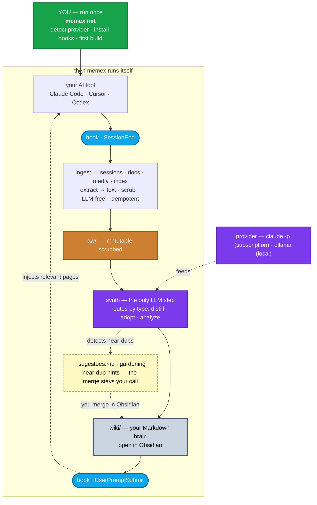

# memex

> A portable, local-first **second brain** built automatically from your AI coding sessions.

`memex` turns the conversations you have with AI coding tools (Claude Code, Cursor, Codex) — plus your code, documents, and notes — into a navigable **Markdown wiki** you own forever and can open in [Obsidian](https://obsidian.md). Inspired by Vannevar Bush's *memex* (1945) and Andrej Karpathy's [LLM-Wiki](https://gist.github.com/karpathy/442a6bf555914893e9891c11519de94f) idea.

**Status:** working end-to-end (v0.0.1). **One command — `memex init` — sets up a workspace; the whole loop (capture → compile → recall) then runs itself via hooks.** Exercised on a real ~2k-session brain. Now ingests sessions **and** documents/media (extracted to text locally) **and** doc indexes (resolved via the provider's MCP), builds per-repo architecture hubs, and self-consolidates near-duplicate pages (`gardening`). Nightly `cron` synth and code-aware RAG are next.

## Why

Most AI sessions start from zero — you re-explain decisions you already made. `memex` captures them once and compounds them into knowledge that:

- **is yours & portable** — plain Markdown + (optional) git. No vendor lock-in. Survives any tool or employer.
- **feeds itself** — hooks capture sessions automatically (LLM-free); a synthesis step compiles them into the wiki.
- **comes back to you** — relevant pages are injected into new sessions automatically.

## How it works (in a sentence)

You run `memex init` **once**. After that it runs itself: each session — plus any documents, media, or doc-index you point it at — lands verbatim in `raw/` → an LLM compiles it into a curated `wiki/` → relevant pages are pulled back into your next session — all via hooks.

```
memex init  ─→  [ sessions/docs/code → raw/ → synth → wiki/ (Obsidian) → recall ]  ↺ automatic
```

## Architecture



**You run `memex init` once** (green). Everything inside *then memex runs itself* is automatic, driven by two hooks: `SessionEnd` captures, `UserPromptSubmit` recalls. Three streams flow into `raw/` — **sessions**, **documents/media** (extracted to text locally), and an optional **doc index** — all scrubbed of secrets at ingest. The provider is decoupled from the medallion tier, and synth runs cwd-isolated so it never triggers its own hooks. Near-duplicate pages are surfaced as **suggestions** (`_sugestoes.md`) or consolidated on demand (`gardening`) — never merged behind your back, because a merge is a semantic call only you should make.

## Design

- **One command (porcelain):** `memex init` is all you run; `status` and `doctor` are there to peek. Everything else (`ingest`, `synth`, `retrieve`, `analyze`, `gardening`, …) is plumbing the hooks call for you — hidden from `--help` on purpose (git's porcelain/plumbing split).
- **CLI (this repo):** open-source, vendor- & OS-agnostic, **zero runtime dependencies** (stdlib only). Install via `uv tool install memex` / `pipx` / `pip`.
- **Vaults (your data):** local & private; `raw/` + `wiki/` live here, not in your code repos.
- **Providers:** pluggable — `claude` CLI or any OpenAI-compatible endpoint (Ollama, LM Studio, vLLM, cloud). The LLM only runs in the synth step; capture + recall hooks are free.
- **Routes by content type:** sessions are **distilled** (durable knowledge extracted); **documents & media** are **adopted** (prose preserved + linked); code is **analyzed** into a few architecture pages (`memex analyze`, never a page per file); config is **skipped**.
- **Documents & media, extracted locally:** `--docs <dir|glob>` bulk-adopts a folder; `--docs-from <path>` pulls in extra roots (e.g. a synced Drive). Non-Markdown files (pdf / docx / pptx / images / audio / video) are turned into text first by whatever extractor you have installed — markitdown, pandoc, pdftotext, python-pptx, tesseract OCR, whisper — and **never leave your machine** (audio/video are whisper-only, never cloud STT). Missing a tool = graceful skip with a hint; non-doc binaries are refused.
- **Doc index (a map, not the files):** some workspaces hold an `_index.jsonl` instead of the docs themselves. memex resolves each entry cheapest-first — its own **description** (auth-free) → the real **local file** (if synced) → the **provider's MCP read tool** (e.g. `get_doc_as_markdown` for a Google Doc). Personal-data entries are skipped by default. `--index`, `--index-base`, `--index-mcp`, `--index-mcp-server`; auto-detected as `<workspace>/_index.jsonl`.
- **Project hubs:** one page ties a workspace's sessions + docs + code together, so a project reads as a single narrative instead of scattered notes.
- **Self-maintaining, not destructive:** memex prevents most duplication at synth time, surfaces the rest as hints in `wiki/_sugestoes.md`, and consolidates on demand with `memex gardening` (clusters near-dups, LLM-merges each into one page, **archives** the absorbed pages recoverably). It never merges behind your back — a merge is a *semantic* decision, so you make it in Obsidian (or run gardening deliberately).
- **Trust tiers (medallion):** `bronze` (raw) / `silver` (sessions/docs, edited freely) / `gold` (code/curated, edited with plan + audit).

## Quickstart

```bash
# (optional) check your setup — provider, hooks, optional extractors
memex doctor

# set up the current workspace. a bare `init` does the three ingests
# (sessions + docs + code architecture) and turns on automatic capture +
# recall. that's it — now just work.
memex init

# compile the whole session/doc backlog into the wiki right now (LLM);
# otherwise pages compile as you work, via the SessionEnd hook
memex init --synth

# peek anytime
memex status --vault ~/memex
```

Handy `init` flags: `--no-analyze` (skip code hubs) · `--no-docs` (skip this workspace's docs) · `--docs-from <path>` (adopt an extra folder, repeatable) · `--index <jsonl>` / `--index-mcp` (ingest a doc index) · `--no-hooks` (don't wire capture/recall).

## Roadmap

- [x] `vault new`, `doctor`, `init` (one-command onboarding)
- [x] `ingest` — sessions (Claude / Cursor / Codex) + docs + **media** (local extraction) + a **doc index** (filesystem + provider-MCP resolver), LLM-free, scrubbed, idempotent
- [x] `synth` — raw → wiki (2-phase, provider-pluggable: `claude` + OpenAI-compatible / Ollama)
- [x] per-type routing — sessions **distill** · docs **adopt** · code **analyze** · config **skip**
- [x] `analyze` — a codebase (or a folder of repos) into a few architecture pages (C4-style), **not** a page per file
- [x] **project hubs** — one page tying a workspace's sessions + docs + code
- [x] `retrieve` + capture hooks · auto-synth on session-end (background, non-blocking)
- [x] self-maintenance — near-dup **suggestions** (`_sugestoes.md`) + `gardening` (cluster + LLM-merge, recoverable)
- [x] `config`, `status`, `log`
- [ ] ADRs / design decisions synthesized from session transcripts
- [ ] code-aware RAG for on-demand, file-level detail
- [ ] nightly `cron` for continuous synth · gold `revert`

## License

[MIT](LICENSE)
