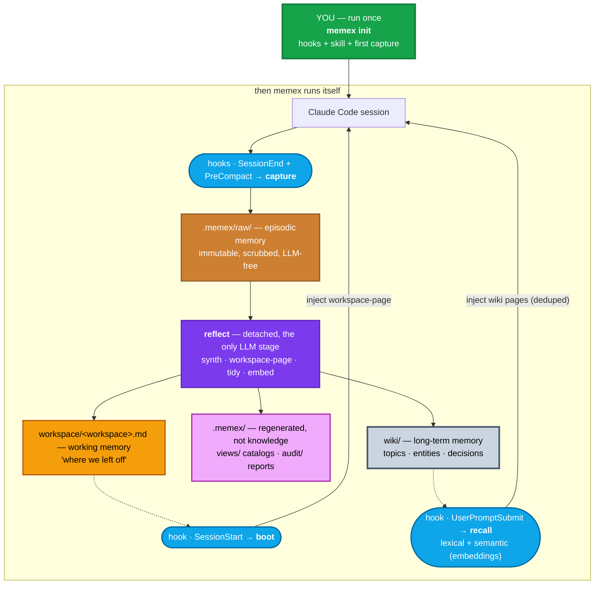

# memex

> Your second brain for AI sessions — decisions, architecture, people, projects, and code, turned into a searchable Markdown wiki and working memory that picks up where you left off.

[](https://python.org)
[](LICENSE)
[](CHANGELOG.md)

---

## What it is

`memex` wires into Claude Code sessions and turns them into durable, navigable knowledge — without leaving your machine.

- **Long-term memory:** a Markdown wiki (`wiki/`) with decisions, entities, projects, and facts. Opens in Obsidian, searchable from the terminal and by the AI.
- **Working memory:** a per-workspace workspace-page (`workspace/<workspace>.md`) injected at session start — "where we left off," no re-explaining.
- **Episodic memory:** immutable, LLM-free raw transcripts (`.memex/raw/`) kept as forensic source material.

Inspired by Vannevar Bush's *memex* (1945) and Karpathy's [LLM-Wiki](https://gist.github.com/karpathy/442a6bf555914893e9891c11519de94f).

---

## Install

```bash
# uv (brings its own Python)
curl -LsSf https://astral.sh/uv/install.sh | sh     # macOS / Linux
winget install astral-sh.uv                         # Windows

# memex
uv tool install git+https://github.com/GianCdM/memex.git
uv tool update-shell

# document extraction (recommended)
uv tool install 'markitdown[all]'
# optional: tesseract (OCR), openai-whisper (audio) — both local, no cloud

# verify
memex doctor
```

All LLM calls go through the Claude Code CLI — log in once (`claude` → `/login`).

Upgrade: `uv tool upgrade memex`.

---

## Quickstart

```bash
memex doctor          # check setup
memex init            # activate this workspace (vault + hooks + skill + backfill)
                      # repeat in each workspace you work in

memex search "dedup pipeline"           # talk to the brain
memex                                   # status: what's in your brain
```

`init` is a deliberate, per-workspace opt-in. It backfills every old session found for that workspace.

Useful flags: `--vault <path>` (separate brain for personal/work) · `--no-analyze` (skip code hubs) · `--no-docs` · `--docs-from <path>` · `--index <jsonl>` · `--index-mcp`.

---

## How it works



Four hooks close the loop. `boot` injects working memory at session start. `recall` injects relevant wiki pages per prompt. `capture` saves every session (even pre-compaction). `reflect` runs detached in the background — synth (raw→wiki) + workspace-page + tidy + embed. Every hook on the session's critical path is LLM-free and exits 0 on error.

An MCP server exposes `search`, `remember` and `status` as structured tools — no Bash escaping, no stdout parsing. A user-level skill teaches Claude to reach for them deliberately.

---

## Memory layers

| Layer | Where | Lifetime | Written by |
|---|---|---|---|
| **Episodic** | `.memex/raw/` | forever, immutable | `capture` (LLM-free) |
| **Working** | `workspace/<workspace>.md` | current effort, overwritten | `reflect` (auto) |
| **Semantic** | `wiki/` | forever, curated | `reflect` / `synth` |

---

## Session → workspace → project

| Claude concept | memex layer | Keyed by |
|---|---|---|
| one **session** | `.memex/raw/` | session id |
| the **workspace** it ran in | `workspace/` | collision-safe path key: Git root or current folder, relative to `HOME` |
| the **project/initiative** | `wiki/` | repo when the workspace is one; otherwise inferred from content |

Many sessions and workspaces feed one project; one generic folder can feed many projects.

---

## Design

- **One command:** `memex init` sets everything up. Bare `memex` shows status. `doctor` checks the setup. Internal plumbing is hidden from `--help`.
- **Zero maintenance:** `reflect` runs detached after every session — synth (raw→wiki) + workspace-page + tidy + embed. Nothing to remember to run.
- **SCHEMA.md is the contract:** the vault ships a schema written for agents — layout, page types, frontmatter, store-vs-skip, supersession. Any agent that reads it can maintain the brain.
- **Recall that behaves:** lexical (IDF-weighted, bilingual stemming) + optional semantic layer (precomputed embeddings with cosine RRF-fusion). Embeddings are auto-refreshed by `reflect` after every synth run. Falls back to lexical-only when not configured.
- **Windows-first portability:** `DETACHED_PROCESS`, UTF-8 forced on stdio, `OpenProcess` for pid-liveness, quote-safe hook commands.
- **CLI:** zero runtime dependencies (stdlib only). Install via `uv tool install` / `pipx` / `pip`.
- **Vaults:** local & private. `.memex/raw/` + `wiki/` + `workspace/` live here, not in your code repos.
- **LLM backend:** Claude Code CLI (`claude -p`). LLM calls happen only in `reflect`/`synth`; every hook on the session's critical path is LLM-free and exits 0 on error.
- **Routes by content type:** sessions are **distilled**, documents & media are **adopted** (pdf/docx/pptx/images/audio via markitdown/whisper/tesseract, local only), code is **analyzed**, config is **skipped**.
- **Page metadata:** `kind` (session/doc/manual/code/merged — where it came from) + `status` (current/superseded/obsolete/deprecated/archived/draft — whether it still holds). Auto-maintained `## 📋 Histórico` changelog on every page.
- **Wiki integrity:** Run `memex audit --dry-run` before applying a recovery lot. Generated views and audit output are under `.memex/`, not canonical wiki pages. Existing-vault migration steps (snapshot → dry-run → human approval → apply → rollback) are in `docs/superpowers/plans/2026-08-06-wiki-integrity-migration-runbook.md`.

---

## Models & Embeddings

Memex uses three model roles per synthesis run — a **proposer** to decide where knowledge lives, a **merger** to write wiki prose, and a **verifier** to catch invention. All LLM calls go through the Claude Code CLI (`claude -p --model <name>`), so any model available to `claude` is usable — Anthropic, OpenRouter, or a corporate GenPlat gateway.

---

**Versioning.** Versions follow [semantic-release](https://semantic-release.gitbook.io/semantic-release): every push to `main` reads conventional commits since the last tag and bumps `pyproject.toml` + `CHANGELOG.md` automatically. See `AGENTS.md` for the full conventions. The version badge above reflects the latest git tag.

### How models are used

| Stage | Config key | What it does |
|---|---|---|
| **Propose** (routing) | `propose` | Reads the raw note + wiki index, decides: which slug / section / tags, or skip. One call per note. |
| **Merge** (writing) | `merge` | Reads the raw note + existing page body, writes or updates the wiki page. One call per note. |
| **Verify** (fidelity) | `verify` | Judges body fidelity against source text. **Skipped mechanically** when the proposed body is empty, unchanged from current, or a verbatim subset of the source (0 LLM). |
| **Gardening** (tidy) | `merge` | Consolidates near-duplicate pages into one coherent page. |
| **Embeddings** (optional) | separate endpoint | Semantic recall — vector search over wiki pages. Incrementally refreshed by `reflect` after each synth run. Falls back to lexical (IDF + stemming) when disabled. |

> **Quote-optional claims.** Proposals may attach verbatim quotes to claims as evidence, but missing a quote is **unanchored**, not unsupported — unanchored claims still pass body-fidelity verification. This makes the pipeline robust across languages and paraphrased sources without needing a stronger proposer just for quote generation.

### Embeddings

Anthropic's API doesn't do embeddings, so this is a separate HTTP endpoint (OpenAI-compatible). Any `/embeddings` gateway works: OpenRouter, a corporate GenPlat proxy, or a local service.

Two config fields control the `input_type` parameter sent to the endpoint:
- `input_type` — sent when indexing (embedding wiki pages for storage)
- `query_input_type` — sent when searching (embedding the search query). Falls back to `input_type` if absent.

| Endpoint | `input_type` | `query_input_type` |
|---|---|---|
| OpenRouter / Nvidia Nemotron | `passage` | `query` |
| GenPlat / Cohere | `search_document` | `search_query` |
| OpenAI / Voyage | omit both | omit both |

When embeddings are unconfigured (`base_url` null), recall falls back to a bilingual lexical scorer (IDF-weighted Jaccard) — zero config, zero cost, works offline.

### Configuration layers

Three layers, each overriding the previous:

```
factory defaults (config.py)
  → ~/.config/memex/config.json   (your global overrides)
    → <vault>/.memex/config.json   (per-vault overrides)
```

**Factory defaults** (`memex/config.py`):

```json
{
  "models": {
    "propose": "haiku",
    "merge": "sonnet",
    "verify": "sonnet"
  },
  "embeddings": {
    "base_url": null,
    "model": null
  }
}
```

**Your global config** (`~/.config/memex/config.json`) — two examples:

*Casa — OpenRouter:*
```json
{
  "default_vault": "~/memex",
  "workspaces": { "/home/user/src/project": "~/memex" },
  "models": {
    "propose": "anthropic/claude-3-5-haiku",
    "merge": "anthropic/claude-sonnet-4-20250514"
  },
  "embeddings": {
    "base_url": "https://openrouter.ai/api/v1",
    "api_key_env": "OPENROUTER_API_KEY",
    "model": "nvidia/nemotron-3-embed-1b:free",
    "input_type": "passage",
    "query_input_type": "query"
  }
}
```

*Trabalho — GenPlat gateway:*
```json
{
  "default_vault": "/Users/you/memex",
  "workspaces": { "/Users/you/src/project": "/Users/you/memex" },
  "models": {
    "propose": "gpt-5-nano",
    "merge": "gpt-5.6-luna",
    "verify": "gpt-5.6-luna"
  },
  "embeddings": {
    "base_url": "https://corp-gateway.example.com/api/v2",
    "api_key_helper": "cat ~/.config/tool/token",
    "model": "embed-multilingual-v3",
    "input_type": "search_document",
    "query_input_type": "search_query"
  }
}
```

`api_key` supports three modes (checked in order):
1. `api_key_env` — name of an env var to read at runtime (e.g. `"OPENAI_API_KEY"`)
2. `api_key_helper` — shell command whose stdout is the token (same pattern as Claude Code's `apiKeyHelper` — never persists short-lived tokens)
3. `api_key` — literal string (last resort; avoid persisting secrets in config files)

**Vault overrides** (`<vault>/.memex/config.json`) — same shape, only the keys that diverge:

```json
{
  "models": {
    "propose": "gpt-5-mini"
  },
  "embeddings": {
    "base_url": null,
    "api_key_env": null
  }
}
```

Set a key to `null` in the vault config to suppress a global value (useful when vault and global use different auth methods). Leave absent to inherit.

### Auto-review, judge model, and doc filters

The verifier that gates every ChangeSet is the **judge**. With `auto_review: true`
the judge decides everything (no human approval); set `verify_model` to a strong
model for that role. The judge is only invoked when **mechanical pre-verify**
cannot decide — the pipeline checks (0 LLM) whether the proposed body is empty,
identical to the current page, or a verbatim subset of the source. Only when
none of those apply does the LLM verifier run.

```json
{
  "auto_review": true,
  "verify_model": "deepseek-v4-pro-official",
  "ingest": {
    "docs": {
      "include": ["docs/**/*.md", "README.md"],
      "exclude": ["**/*.log", "pessoal/automation/**"],
      "skip_ids": ["**/morning-routine.log"]
    }
  }
}
```

`ingest.docs` is an allowlist/denylist for the `--docs` walk and doc-index:
`include` restricts to matching files, `exclude` drops them, `skip_ids` drops
index entries by locator. Empty/missing = legacy behavior (adopt every prose
file). This is how you keep a personal automation log or a growing `.log` out of
the wiki without hardcoding anything.

### Pipeline knobs (per-vault `limits` block)

All the behavioral limits live in `memex/limits.py` and can be overridden per
vault via a `"limits"` block in the vault config (unknown keys are ignored):

| Knob | Default | What it does |
|---|---|---|
| `raw_excerpt_chars` | 50000 | how much of a raw note the MERGE step sees |
| `raw_propose_chars` | 12000 | how much the PROPOSE classifier sees (routing is coarse → small budget) |
| `verify_workers` | 2 | cap on concurrent verify-model calls per run (0 = uncapped) |
| `verify_strong_body_chars` | 8000 | proposed bodies larger than this always go to the verifier LLM |
| `index_neighbors` | 20 | pages shown to the propose step from the index |

### Session-delta pipeline: the wiki reads the raw's progression, not its snapshot

A long session is captured many times (each PreCompact / SessionEnd writes a
full accumulated snapshot with the same `id`). Instead of re-distilling the
whole snapshot every time — which truncates the middle of a >50k session — the
wiki consumes the raw **incrementally**:

```text
Claude JSONL (append-only)
  └─ capture → raw snapshot (immutable, preserved)
       ├─ workspace: delta since its cursor → working memory
       └─ wiki synth: delta since its checkpoint → merge/verify → page
```

The workspace never becomes the wiki's source: both read the same raw, but keep
**separate checkpoints** (the workspace's per-page cursor vs the wiki's
`.memex/lineage.json` per-session `chars`+`prefix_hash`).

How a re-capture routes (in `.memex/lineage.json`):

- **strict append** (the new body's prefix still hashes to the recorded
  checkpoint) → `session-delta` / `doc-delta`: propose is **skipped**, the
  slug/section come from lineage, only the new **tail** is distilled into the
  existing page, and the verifier judges it **against the tail** with a
  dedicated distilled-delta prompt (body fidelity — a delta carries no
  per-claim anchors by design, and content already on the page is out of scope).
- **empty tail** → superseded with no LLM (a short-but-material tail is never
  dropped on a length threshold; the verifier's `value: same` catches no-ops).
- **edited / shrunk / page archived or renamed** → safe full fallback: never a
  fabricated delta, never a headless page.

Routing: only `supported` auto-applies. A `partial` session-delta (durable tail
content not reflected) **parks** for review, so the checkpoint never advances
past unreflected content; `ambiguous` parks too (an uncertain judge must never
burn a session's tail). The evidence-anchored claim gate is skipped for verified
deltas (a delta is grounded to its raw tail by body fidelity). The checkpoint
advances **only** when the delta actually applies; a provider error keeps the
raw pending for the next run.

`memex deltas` is a read-only dry-run of the historical surface — it groups
raws by session, walks the append chain (prefix hashes), and reports which
sessions already have a checkpoint vs which a chunked backfill would need to
re-read:

```bash
memex deltas --vault ~/memex
```

### Pipeline telemetry: `memex metrics`

Every synthesized raw appends a JSONL line to `.memex/metrics.jsonl`
(kind, mode, outcome, route, latency, body size, models; `mode` is `full`,
`doc-delta` or `session-delta`, with `delta_chars`/`checkpoint_before`/
`checkpoint_after` on delta rows). `memex metrics` summarizes it — counts by
outcome/route/kind/**mode**, average latency, and the active judge model — so
cost/quality decisions are grounded in real numbers:

```bash
memex metrics --vault ~/memex            # everything
memex metrics --vault ~/memex --since 2026-08-01   # last week
```

The `golden/` directory holds eval fixtures (raw → expected page) to regression
test the synth before changing budgets, models, or routing.

### Concurrency & fine-tuning

---

## How Claude uses it (MCP + skill)

`memex init` wires an MCP server and installs a user skill. Claude gets three structured tools:

| Tool | What it does |
|---|---|
| `search` | Find pages by keyword — returns scored results with file paths. Read the path for full detail. |
| `remember` | File a fact, decision, or preference into the brain. Synthesized into a wiki page immediately. |
| `status` | Peek at the brain — raw notes, wiki pages, pending synthesis, workspace-pages. |

The skill teaches Claude *when* to use them:

| You say… | Claude does |
|---|---|
| *"how did we decide X?"* | calls `search` → Reads returned pages |
| *"who owns X?"* | calls `search`, follows `[[wikilinks]]` |
| *"remember this"* | calls `remember` with the fact |

Fallback: `memex search` from the terminal. `/memex` also works as a slash command.

---

## Make it yours

The vault root has an `ABOUT.md` — your role, day-to-day, what you care about, language, teams. The synthesizer injects it into every distill/propose call, so knowledge is judged from your perspective. Edit the file, change the brain.

---

## Obsidian

The vault **is** an Obsidian vault — point Obsidian at it and you get graph view, backlinks, and search. Raw evidence lives under `.memex/raw/` (a dot-dir, so Obsidian never lists it nor tries to render the giant session captures — no per-vault settings needed).

Already have an Obsidian vault? `memex init --vault <your-vault>` is non-destructive — it only adds its files. To fold existing notes in: `memex ingest --vault <your-vault> --docs <folder>`.

---

## Testing

```bash
python -m unittest discover -s tests        # no LLM, no network — patched completions
bash tests/live_e2e.sh                      # live loop on the real machine (mock LLM)
```

190 tests, 0 failures.

---

## License

[MIT](LICENSE)
