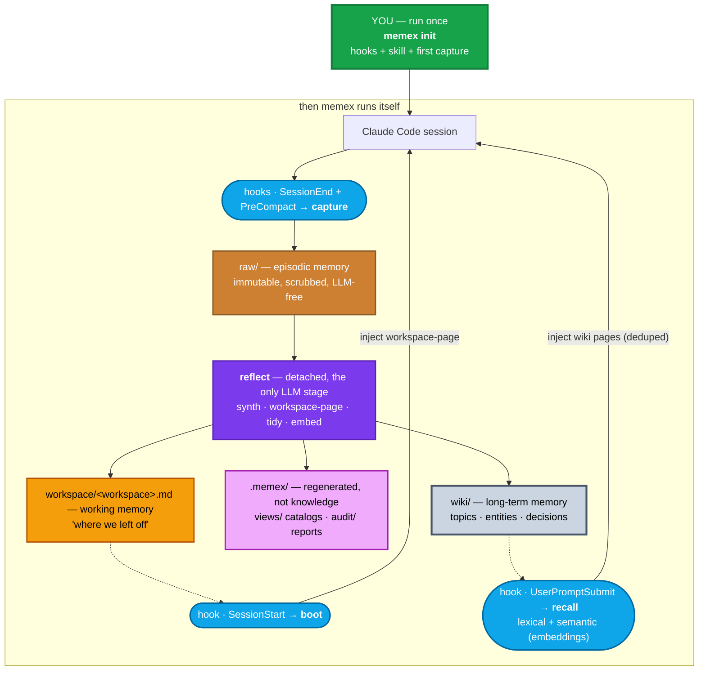

# memex

> Your second brain for AI sessions — decisions, architecture, people, projects, and code, turned into a searchable Markdown wiki and working memory that picks up where you left off.

[](https://python.org)
[](LICENSE)

---

## What it is

`memex` wires into your AI tools (Claude Code, Cursor, Codex) and turns every session into durable, navigable knowledge — without leaving your machine.

- **Long-term memory:** a Markdown wiki (`wiki/`) with decisions, entities, projects, and facts. Opens in Obsidian, searchable from the terminal and by the AI.
- **Working memory:** a per-workspace workspace-page (`workspace/<workspace>.md`) injected at session start — "where we left off," no re-explaining.
- **Episodic memory:** immutable, LLM-free raw transcripts (`raw/`) kept as forensic source material.

Inspired by Vannevar Bush's *memex* (1945) and Karpathy's [LLM-Wiki](https://gist.github.com/karpathy/442a6bf555914893e9891c11519de94f).

---

## Install

```bash
# uv (brings its own Python)
curl -LsSf https://astral.sh/uv/install.sh | sh     # macOS / Linux
winget install astral-sh.uv                         # Windows

# memex
uv tool install git+https://github.com/GianCdM/memex.git
uv tool update-shell

# document extraction (recommended)
uv tool install 'markitdown[all]'
# optional: tesseract (OCR), openai-whisper (audio) — both local, no cloud

# verify
memex doctor
```

The `claude` provider needs the Claude Code CLI logged in once (`claude` → `/login`). Alternative: any OpenAI-compatible endpoint (Ollama runs free and local).

Upgrade: `uv tool upgrade memex`.

---

## Quickstart

```bash
memex doctor          # check setup
memex init            # activate this workspace (vault + hooks + skill + backfill)
                      # repeat in each workspace you work in

memex search "dedup pipeline"           # talk to the brain
memex                                   # status: what's in your brain
```

`init` is a deliberate, per-workspace opt-in. It backfills every old session found for that workspace.

Useful flags: `--vault <path>` (separate brain for personal/work) · `--no-analyze` (skip code hubs) · `--no-docs` · `--docs-from <path>` · `--index <jsonl>` · `--index-mcp`.

---

## How it works



Four hooks close the loop. `boot` injects working memory at session start. `recall` injects relevant wiki pages per prompt. `capture` saves every session (even pre-compaction). `reflect` runs detached in the background — synth (raw→wiki) + workspace-page + tidy + embed. Every hook on the session's critical path is LLM-free and exits 0 on error.

An MCP server exposes `search`, `remember` and `status` as structured tools — no Bash escaping, no stdout parsing. A user-level skill teaches Claude to reach for them deliberately.

---

## Memory layers

| Layer | Where | Lifetime | Written by |
|---|---|---|---|
| **Episodic** | `raw/` | forever, immutable | `capture` (LLM-free) |
| **Working** | `workspace/<workspace>.md` | current effort, overwritten | `reflect` (auto) |
| **Semantic** | `wiki/` | forever, curated | `reflect` / `synth` |
| **Generated views** | `.memex/views/` | regenerated, machine-owned | `reflect` / `synth` |
| **Audit** | `.memex/audit/` | regenerated, machine-owned | `gardening` |

---

## Session → workspace → project

| Claude concept | memex layer | Keyed by |
|---|---|---|
| one **session** | `raw/` | session id |
| the **workspace** it ran in | `workspace/` | collision-safe path key: Git root or current folder, relative to `HOME` |
| the **project/initiative** | `wiki/` | repo when the workspace is one; otherwise inferred from content |

Many sessions and workspaces feed one project; one generic folder can feed many projects.

---

## Design

- **One command:** `memex init` sets everything up. Bare `memex` shows status. `doctor` checks the setup. Internal plumbing is hidden from `--help`.
- **Zero maintenance:** `reflect` runs detached after every session — synth (raw→wiki) + workspace-page + tidy + embed. Nothing to remember to run.
- **SCHEMA.md is the contract:** the vault ships a schema written for agents — layout, page types, frontmatter, store-vs-skip, supersession. Any agent that reads it can maintain the brain.
- **Recall that behaves:** lexical (IDF-weighted, bilingual stemming) + optional semantic layer (precomputed embeddings with cosine RRF-fusion). Embeddings are auto-refreshed by `reflect` after every synth run. Falls back to lexical-only when not configured.
- **Windows-first portability:** `DETACHED_PROCESS`, UTF-8 forced on stdio, `OpenProcess` for pid-liveness, quote-safe hook commands.
- **CLI:** zero runtime dependencies (stdlib only). Install via `uv tool install` / `pipx` / `pip`.
- **Vaults:** local & private. `raw/` + `wiki/` + `workspace/` live here, not in your code repos.
- **Providers:** `claude` CLI or any OpenAI-compatible endpoint. LLM runs only in `reflect`/`synth`; every hook on the session's critical path is LLM-free and exits 0 on error.
- **Routes by content type:** sessions are **distilled**, documents & media are **adopted** (pdf/docx/pptx/images/audio via markitdown/whisper/tesseract, local only), code is **analyzed**, config is **skipped**.
- **Page metadata:** `kind` (session/doc/manual/code/merged — where it came from) + `status` (current/superseded/obsolete/deprecated/archived/draft — whether it still holds). Auto-maintained `## 📋 Histórico` changelog on every page.
- **Wiki integrity:** Run `memex audit --dry-run` before applying a recovery lot. Generated views and audit output are under `.memex/`, not canonical wiki pages. Existing-vault migration steps (snapshot → dry-run → human approval → apply → rollback) are in `docs/superpowers/plans/2026-08-06-wiki-integrity-migration-runbook.md`.

---

## Models & Providers

Memex uses two models per synthesis run — a **cheap one** to propose where to file a note, and a **strong one** to write the actual wiki page. They're configured per provider in `~/.config/memex/config.json`.

### How models are used

| Stage | Model | What it does |
|---|---|---|
| **Synth phase 1** (propose) | `model_propose` | Reads the raw note + wiki index, decides: which slug / section / tags, or skip. One cheap call per note. |
| **Synth phase 2** (merge) | `model_merge` | Reads the raw note + existing page body, writes or updates the wiki page. One strong call per note. |
| **Reflect** (workspace-page) | `model_propose` or `model_merge` | Distills the session transcript tail into the workspace handoff page. |
| **Gardening** (tidy) | `model_merge` | Consolidates near-duplicate pages into one coherent page. |
| **Embeddings** (optional) | separate provider | Semantic recall — vector search over wiki pages. Incrementally refreshed by `reflect` after each synth run. Falls back to lexical (IDF + stemming) when disabled. |

### Supported providers

**Generation (LLM):**

| Provider | Backend | How it works |
|---|---|---|
| `claude` | Claude Code CLI (`claude -p --model`) | Works out of the box. Supports MCP tools in prompts for doc resolution. |
| `ollama` | OpenAI-compatible HTTP | Local, free. Any model you've pulled. |
| `openai` | OpenAI-compatible HTTP | GPT-4o, GPT-4o-mini, or any OpenAI model. |
| `lmstudio` / `vllm` | OpenAI-compatible HTTP | Self-hosted inference servers. Any OpenAI-compatible endpoint works. |

**Embeddings (semantic recall):**

A separate HTTP provider — Anthropic's API doesn't do embeddings, so this is independent. Any OpenAI-compatible `/embeddings` endpoint works:

- **Cohere:** `base_url=https://api.cohere.com/v2`, `model=embed-multilingual-v3.0` (needs `input_type`)
- **OpenAI:** `base_url=https://api.openai.com/v1`, `model=text-embedding-3-small`
- **Voyage:** `base_url=https://api.voyageai.com/v1`, `model=voyage-3-lite`
- **Ollama:** `base_url=http://localhost:11434/v1`, `model=nomic-embed-text`

When embeddings are disabled (`base_url` is empty or unset), recall falls back to a bilingual lexical scorer (IDF-weighted Jaccard) — zero config, zero cost, works offline.

### Configuration layers

Three layers, each overriding the previous:

```
factory defaults (config.py)
  → ~/.config/memex/config.json   (your global overrides)
    → <vault>/.memex/config.json   (per-vault overrides)
```

**Factory defaults** (`memex/config.py`):

```json
{
  "provider": {
    "order": ["claude", "ollama"],
    "claude": {
      "model_propose": "haiku",
      "model_merge": "sonnet"
    },
    "ollama": {
      "base_url": "http://localhost:11434/v1",
      "model_propose": "qwen2.5:7b",
      "model_merge": "deepseek-r1:14b"
    },
    "embeddings": {
      "base_url": null,
      "model": null
    }
  }
}
```

**Your config** (`~/.config/memex/config.json`) — example using a corporate LLM gateway (GenPlat):

```json
{
  "provider": {
    "order": ["claude"],
    "claude": {
      "model_propose": "deepseek-v4-flash-claude",
      "model_merge": "deepseek-v4-pro-claude[1m]"
    },
    "embeddings": {
      "base_url": "https://your-gateway.corp.com/api/v2",
      "model": "embed-multilingual-v3",
      "input_type": "search_document",
      "api_key_helper": "your-token-helper --format token"
    }
  }
}
```

The `embeddings` provider is a separate HTTP endpoint — any gateway that speaks the OpenAI `/embeddings` protocol works. Corporate LLM gateways (GenPlat, etc.) proxy models like Cohere's `embed-multilingual-v3` without ever hitting the public API.

`api_key` supports three modes (checked in order):
1. `api_key_env` — name of an env var to read at runtime (e.g. `"OPENAI_API_KEY"`)
2. `api_key_helper` — shell command whose stdout is the token (same pattern as Claude Code's `apiKeyHelper` — never persists short-lived tokens)
3. `api_key` — literal string (last resort; avoid persisting secrets in config files)

**Vault overrides** (`<vault>/.memex/config.json`):

```json
{"models": {"propose": null, "merge": null}}
```

Set to a model name to override only that vault. Leave `null` to use the global provider config.

### Provider order & fallback

`provider.order` is a list — memex tries providers in order until one succeeds. The default is `["claude", "ollama"]`: use Claude Code if available, fall back to local Ollama.

Run `memex doctor` to see which providers are detected on your machine:

```
Detected providers:
  claude CLI : OK  ~/.../claude
  ollama     : OK
```

---

## How Claude uses it (MCP + skill)

`memex init` wires an MCP server and installs a user skill. Claude gets three structured tools:

| Tool | What it does |
|---|---|
| `search` | Find pages by keyword — returns scored results with file paths. Read the path for full detail. |
| `remember` | File a fact, decision, or preference into the brain. Synthesized into a wiki page immediately. |
| `status` | Peek at the brain — raw notes, wiki pages, pending synthesis, workspace-pages. |

The skill teaches Claude *when* to use them:

| You say… | Claude does |
|---|---|
| *"how did we decide X?"* | calls `search` → Reads returned pages |
| *"who owns X?"* | calls `search`, follows `[[wikilinks]]` |
| *"remember this"* | calls `remember` with the fact |

Fallback: `memex search` from the terminal. `/memex` also works as a slash command.

---

## Make it yours

The vault root has an `ABOUT.md` — your role, day-to-day, what you care about, language, teams. The synthesizer injects it into every distill/propose call, so knowledge is judged from your perspective. Edit the file, change the brain.

---

## Obsidian

The vault **is** an Obsidian vault — point Obsidian at it and you get graph view, backlinks, and search. Exclude `raw/` from Obsidian's settings (it's the forensic layer, noisy by design).

Already have an Obsidian vault? `memex init --vault <your-vault>` is non-destructive — it only adds its files. To fold existing notes in: `memex ingest --vault <your-vault> --docs <folder>`.

---

## Testing

```bash
python -m unittest discover -s tests        # no LLM, no network — mock provider
bash tests/live_e2e.sh                      # live loop on the real machine (mock LLM)
```

64 tests, 0 failures.

---

## License

[MIT](LICENSE)
