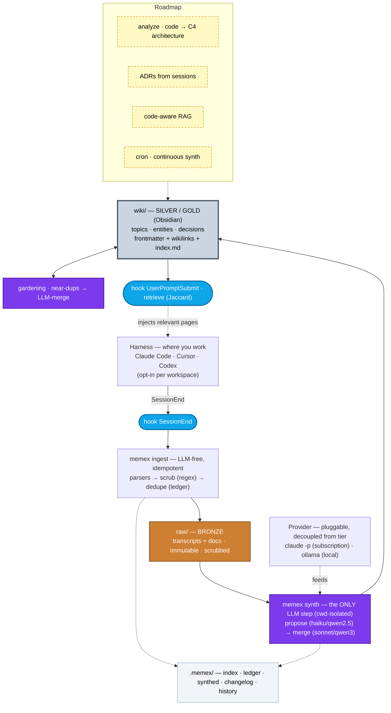

# memex

> A portable, local-first **second brain** built automatically from your AI coding sessions.

`memex` turns the conversations you have with AI coding tools (Claude Code, Cursor, Codex) — plus your code and notes — into a navigable **Markdown wiki** you own forever and can open in [Obsidian](https://obsidian.md). Inspired by Vannevar Bush's *memex* (1945) and Andrej Karpathy's [LLM-Wiki](https://gist.github.com/karpathy/442a6bf555914893e9891c11519de94f) idea.

**Status:** working end-to-end (v0.0.1). The full loop — capture → `ingest` → `synth` → `gardening` → `retrieve`, with per-workspace hooks — is built and exercised on a real ~2k-session brain. Codebase-as-architecture (`analyze`) and continuous synth (`cron`) are next.

## Why

Most AI sessions start from zero — you re-explain decisions you already made. `memex` captures them once and compounds them into knowledge that:

- **is yours & portable** — plain Markdown + (optional) git. No vendor lock-in. Survives any tool or employer.
- **feeds itself** — hooks capture sessions automatically (LLM-free); a synthesis step compiles them into the wiki.
- **comes back to you** — relevant pages are injected into new sessions automatically.

## How it works (in a sentence)

Sessions / code / docs land verbatim in `raw/` → an LLM compiles them into a curated `wiki/` → you read & curate it in Obsidian, and it gets pulled back into your next session.

```
sources → raw/ (forensic) → synth → wiki/ (knowledge) → Obsidian + auto-recall
```

## Architecture



The **live loop** (solid arrows): `Harness → SessionEnd → ingest → raw/ → synth → wiki/ → UserPromptSubmit (retrieve) → back to Harness`. Secrets are scrubbed at ingest (deterministic regex), the provider is decoupled from the medallion tier, and synth runs cwd-isolated so it never triggers its own capture hooks.

## Design

- **CLI (this repo):** open-source, vendor- & OS-agnostic. Install via `uv tool install memex` / `pipx` / `pip`.
- **Vaults (your data):** local & private; `raw/` + `wiki/` live here, not in your code repos.
- **Providers:** pluggable — `claude` CLI or any OpenAI-compatible endpoint (Ollama, LM Studio, vLLM, cloud). The LLM only runs in the synth step; capture hooks are free.
- **Trust tiers (medallion):** `bronze` (raw) / `silver` (sessions/docs, edited freely) / `gold` (code/curated, edited with plan + audit).

## Quickstart (current)

```bash
# detect your environment and get a recommended provider/model setup
memex doctor

# create your brain
memex vault new ~/vaults/personal
```

## Roadmap

- [x] `vault new`, `doctor`, `init` (one-command onboarding)
- [x] `ingest` — sessions (Claude / Cursor / Codex) + codebase + docs (LLM-free, scrubbed, idempotent)
- [x] `synth` — raw → wiki (2-phase, provider-pluggable: `claude` + OpenAI-compatible / Ollama)
- [x] `retrieve` + capture hooks (opt-in per workspace, merge-safe)
- [x] `gardening` — consolidate near-duplicate pages (cluster + LLM-merge)
- [x] `config`, `status`, `log`
- [ ] `analyze` — synthesize a codebase into a few architecture pages (C4-style), **not** a page per file
- [ ] ADRs / design decisions synthesized from session transcripts
- [ ] code-aware RAG for on-demand, file-level detail
- [ ] nightly `cron` for continuous synth · gold `revert`

## License

[MIT](LICENSE)
