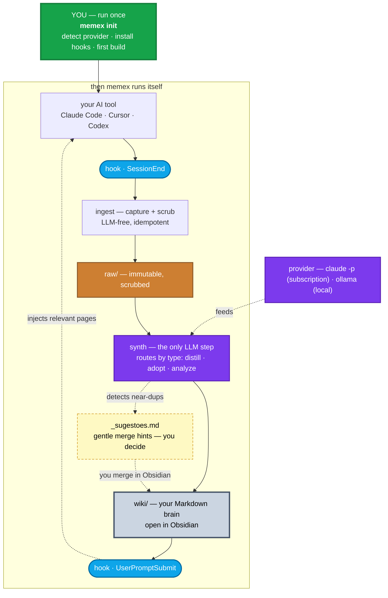

# memex

> A portable, local-first **second brain** built automatically from your AI coding sessions.

`memex` turns the conversations you have with AI coding tools (Claude Code, Cursor, Codex) — plus your code and notes — into a navigable **Markdown wiki** you own forever and can open in [Obsidian](https://obsidian.md). Inspired by Vannevar Bush's *memex* (1945) and Andrej Karpathy's [LLM-Wiki](https://gist.github.com/karpathy/442a6bf555914893e9891c11519de94f) idea.

**Status:** working end-to-end (v0.0.1). **One command — `memex init` — sets up a workspace; the whole loop (capture → compile → recall) then runs itself via hooks.** Exercised on a real ~2k-session brain. Codebase-as-architecture (`analyze`) and continuous synth (`cron`) are next.

## Why

Most AI sessions start from zero — you re-explain decisions you already made. `memex` captures them once and compounds them into knowledge that:

- **is yours & portable** — plain Markdown + (optional) git. No vendor lock-in. Survives any tool or employer.
- **feeds itself** — hooks capture sessions automatically (LLM-free); a synthesis step compiles them into the wiki.
- **comes back to you** — relevant pages are injected into new sessions automatically.

## How it works (in a sentence)

You run `memex init` **once**. After that it runs itself: each session lands verbatim in `raw/` → an LLM compiles it into a curated `wiki/` → relevant pages are pulled back into your next session — all via hooks.

```
memex init  ─→  [ sessions/code/docs → raw/ → synth → wiki/ (Obsidian) → recall ]  ↺ automatic
```

## Architecture



**You run `memex init` once** (green). Everything inside *then memex runs itself* is automatic, driven by two hooks: `SessionEnd` captures, `UserPromptSubmit` recalls. Secrets are scrubbed at ingest, the provider is decoupled from the medallion tier, and synth runs cwd-isolated so it never triggers its own hooks. Near-duplicate pages are surfaced as **suggestions** (`_sugestoes.md`) — never merged behind your back, because a merge is a semantic call only you should make.

## Design

- **One command (porcelain):** `memex init` is all you run; `status` and `doctor` are there to peek. Everything else (`ingest`, `synth`, `retrieve`, …) is plumbing the hooks call for you — hidden from `--help` on purpose (git's porcelain/plumbing split).
- **CLI (this repo):** open-source, vendor- & OS-agnostic. Install via `uv tool install memex` / `pipx` / `pip`.
- **Vaults (your data):** local & private; `raw/` + `wiki/` live here, not in your code repos.
- **Providers:** pluggable — `claude` CLI or any OpenAI-compatible endpoint (Ollama, LM Studio, vLLM, cloud). The LLM only runs in the synth step; capture + recall hooks are free.
- **Routes by content type:** sessions are **distilled** (durable knowledge extracted), curated docs are **adopted** (prose preserved + linked), code is **analyzed** into a few architecture pages (`memex analyze`, never a page per file), config is **skipped**.
- **Self-maintaining, not destructive:** memex prevents most duplication at synth time and surfaces the rest as hints in `wiki/_sugestoes.md`. It never merges pages behind your back — a merge is a *semantic* decision, so you make it in Obsidian (or ignore it).
- **Trust tiers (medallion):** `bronze` (raw) / `silver` (sessions/docs, edited freely) / `gold` (code/curated, edited with plan + audit).

## Quickstart

```bash
# (optional) check your setup — provider, hooks
memex doctor

# set up the current workspace: builds your brain and turns on
# automatic capture + recall. that's it — now just work.
memex init

# peek anytime
memex status --vault ~/memex
```

## Roadmap

- [x] `vault new`, `doctor`, `init` (one-command onboarding)
- [x] `ingest` — sessions (Claude / Cursor / Codex) + docs (LLM-free, scrubbed, idempotent)
- [x] `synth` — raw → wiki (2-phase, provider-pluggable: `claude` + OpenAI-compatible / Ollama)
- [x] per-type routing — sessions **distill** · docs **adopt** · code **analyze** · config **skip**
- [x] `analyze` — synthesize a codebase into a few architecture pages (C4-style), **not** a page per file
- [x] `retrieve` + capture hooks · auto-synth on session-end (background, non-blocking)
- [x] self-maintenance — near-dup detection surfaced as Obsidian suggestions (the semantic merge stays your call)
- [x] `config`, `status`, `log`
- [ ] ADRs / design decisions synthesized from session transcripts
- [ ] code-aware RAG for on-demand, file-level detail
- [ ] nightly `cron` for continuous synth · gold `revert`

## License

[MIT](LICENSE)
