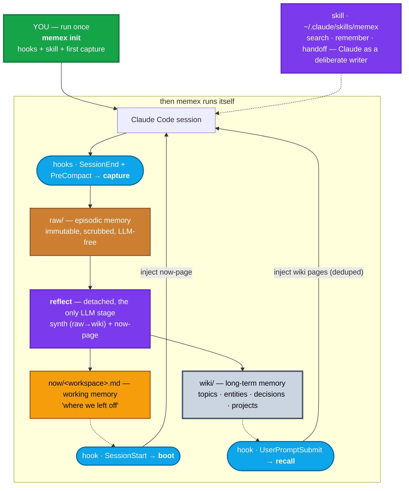

# memex

> A local-first **active brain** for everything you do with your AI — management, architecture, tech-leadership *and* coding. Short-term and long-term memory, wired into the harness itself.

`memex` turns the sessions you have with AI tools (Claude Code, Cursor, Codex) — decisions, meetings, people, projects, code — plus your documents and repos, into a navigable **Markdown wiki** you own forever and can open in [Obsidian](https://obsidian.md), *and* into **working memory** that lets a brand-new session pick up exactly where the last one stopped. Inspired by Vannevar Bush's *memex* (1945) and Andrej Karpathy's [LLM-Wiki](https://gist.github.com/karpathy/442a6bf555914893e9891c11519de94f).

**Status:** v2.1 — working end-to-end, Windows/macOS/Linux. **One command — `memex init` — and the whole loop runs itself, maintenance included.** Full unit suite (mock LLM, no network) + a live e2e that exercises the real hook commands on the real machine.

## Why

Most AI sessions start from zero — you re-explain decisions you already made, and "continua de onde paramos" means re-pasting context by hand. `memex` fixes both halves, for a manager's day as much as an engineer's:

- **Long-term memory** — durable knowledge (decisions org & technical, commitments, people/team facts, invariants, fixes, preferences) compiles into a wiki that is yours & portable: plain Markdown + optional git, no vendor lock-in.
- **Short-term memory** — each workspace keeps a *now-page* ("where we left off"); new sessions **boot with it already injected**, so you can just say "bora continuar".
- **An agent that knows its brain** — a user-level skill teaches Claude to search the wiki, file facts, and save state deliberately. The wiki isn't a side artifact; it's a read/write surface for the agent (the LLM-Wiki model).
- **Zero maintenance** — synthesis, backlog processing, and near-duplicate consolidation all run in the background after sessions end. There is no command you have to remember to run.

## Session · workspace · project (one key per layer)

| Claude concept | memex layer | Keyed by |
|---|---|---|
| one **session** (a conversation) | `raw/` — episodic | session id |
| the **workspace** it ran in (folder/repo) | `now/` — working memory | git repo name, else folder name |
| the **project/initiative** it's about | `wiki/` — semantic | repo when the workspace is one; otherwise **inferred from content** (a management session run from any folder still lands in the right initiative) |

Many sessions and many workspaces feed one project; one generic folder can feed many projects.

## How it works (in a sentence)

You run `memex init` **once** per workspace; after that, four hooks close the loop — **boot** injects working memory at session start, **recall** injects relevant wiki pages per prompt, **capture** saves each session (even before compaction), and a detached **reflect** compiles it all in the background.

```
memex init ─→ [ boot ⇢ session ⇢ recall ⇢ capture ⇢ reflect(synth+now) ] ↺ automatic
```

## Architecture



Three memory layers, mapped to how brains actually work:

| Layer | Where | Lifetime | Written by |
|---|---|---|---|
| **Episodic** | `raw/` | forever, immutable | capture (LLM-free, scrubbed) |
| **Working** | `now/<workspace>.md` | current effort, overwritten | `memex handoff` (deliberate) or reflect (auto) |
| **Semantic** | `wiki/` | forever, curated | reflect/synth (distill · adopt · analyze) |

A deliberate `handoff` (Claude writing its own state — it knows the session best) holds off the automatic one for a few hours, so the good version wins. Durable facts graduate from working memory into the wiki via synthesis — never by accretion.

## Design

- **One command (porcelain):** `memex init` sets everything up; bare `memex` shows your brain; `doctor` checks the setup; `search` / `remember` / `handoff` are the deliberate verbs (for you *and* for Claude, via the skill). The hook plumbing (`boot`, `recall`, `capture`, `reflect`, `tidy`, `synth`, …) is hidden from `--help` on purpose.
- **Maintenance is automatic:** after each session, the detached `reflect` synthesizes the whole pending backlog (cost-bounded per run) and, on a weekly cadence, consolidates near-duplicate pages (`tidy`, recoverable — absorbed pages archive to `.memex/history/`). Below-threshold overlaps surface as suggestions in `wiki/_sugestoes.md`.
- **SCHEMA.md is the contract:** the vault ships a schema (Karpathy's model: sources → wiki → schema) written for agents — layout, page types, frontmatter rules, store-vs-skip, supersession of decisions. Any agent that reads it can maintain the brain.
- **The harness is the runtime:** SessionStart/UserPromptSubmit/SessionEnd/PreCompact hooks + a model-invocable skill. PreCompact capture means nothing is lost even if a session dies mid-flight; the final capture supersedes the partial one (same session → same raw file → newer hash → re-synth).
- **Recall that behaves:** IDF-weighted ranking with bilingual (pt/en) prefix-stemming (`alertas`~`alerts`), per-session dedup (never re-injects the same page into one session), and absolute file paths so the model can `Read` the full page.
- **Windows-first portability:** no `nohup`/`$(date)` shellisms — detaching happens in Python (`DETACHED_PROCESS`); hook commands are absolute-path, quote-safe in Git Bash *and* cmd; UTF-8 is forced on stdin/stdout (cp1252 consoles); pid-liveness uses `OpenProcess` (on Windows, `os.kill(pid, 0)` *kills* the process).
- **CLI (this repo):** open-source, vendor- & OS-agnostic, **zero runtime dependencies** (stdlib only). Install via `uv tool install memex` / `pipx` / `pip`.
- **Vaults (your data):** local & private; `raw/` + `wiki/` + `now/` live here, not in your code repos.
- **Providers:** pluggable — `claude` CLI or any OpenAI-compatible endpoint (Ollama, LM Studio, vLLM, cloud). The LLM runs ONLY in reflect/synth; every hook on the session's critical path is LLM-free and exits 0 on any error.
- **Routes by content type:** sessions are **distilled** (durable knowledge extracted, head+tail of long transcripts); **documents & media** are **adopted** (prose preserved + linked, extracted locally — pdf/docx/pptx/images/audio via markitdown/whisper/tesseract, never leaving your machine); code is **analyzed** into architecture pages; config is **skipped**.
- **Self-maintaining, not destructive:** near-duplicates consolidate automatically (weekly `tidy`; absorbed pages archive recoverably) with below-threshold overlaps surfaced in `_sugestoes.md`; gold pages snapshot history before edits; decisions are superseded, never deleted.
- **Trust tiers (medallion):** `bronze` (raw) / `silver` (sessions/docs, edited freely) / `gold` (code/curated, edited with audit).

## Quickstart

```bash
# check your setup — providers, hooks, skill, extractors
memex doctor

# set up the current workspace: vault + 4 hooks + skill + backlog capture.
# that's it — restart your AI tool in this workspace and just work.
memex init

# the claude provider needs the CLI logged in ONCE (interactive):
claude /login

# talk to the brain, from anywhere (Claude uses these too, via the skill):
memex search "dedup pipeline vendas"
memex remember "Decidimos X porque Y."
memex handoff --show
memex                       # bare = status: what's in your brain
```

Handy `init` flags: `--no-analyze` (skip code hubs) · `--no-docs` (skip this workspace's docs) · `--docs-from <path>` (adopt an extra folder, repeatable) · `--index <jsonl>` / `--index-mcp` (ingest a doc index) · `--no-hooks` / `--no-skill` (don't wire the automation).

## Testing

```bash
python -m unittest discover -s tests        # no LLM, no network — mock provider
bash tests/live_e2e.sh                      # live loop on the real machine (mock LLM)
```

The live e2e installs real hooks in a throwaway workspace and pipes real hook payloads through the *installed command strings* — boot silence on an empty brain, PreCompact partial capture, detached reflect building wiki + now-page, boot injection on the next session, recall dedup, handoff hold, `remember`, UTF-8 integrity, and a cmd.exe quoting leg.

## Roadmap

- [x] v1: `init` / `ingest` (sessions + docs + media + doc-index) / `synth` / `analyze` / project hubs / `gardening` / `retrieve`
- [x] v2: **working memory** (`now/`, `handoff`, auto-refresh with hold) — sessions continue across restarts
- [x] v2: **boot** (SessionStart) · **recall** (IDF + bilingual stemming + session dedup + paths) · **capture** (SessionEnd + PreCompact, transcript straight from the hook payload) · **reflect** (detached)
- [x] v2: user-level **skill** (`search` / `remember` / `handoff`) — the agent as a deliberate reader/writer
- [x] v2: Windows-first hooks (no shellisms, UTF-8, OpenProcess, portable quoting) + SCHEMA.md as agent contract + `log.md`
- [x] v2.1: **manager-first** — synthesis lens covers decisions org & técnica, action items/commitments, people/teams; projects inferred from content when the workspace isn't a repo
- [x] v2.1: **zero-maintenance** — reflect processes the whole backlog + auto-tidy on a cadence; stubs removed; bare `memex` = status; `gardening` → hidden `tidy`
- [ ] per-workspace **journal** ("o que fiz essa semana") — one dated digest line per session, compiled automatically; weekly-review material for managers
- [ ] recurring sources (email/Slack/meeting notes via MCP on a schedule) feeding `raw/`
- [ ] memex as a Claude Code **plugin** (hooks + skill bundled; one install per machine, no per-workspace wiring)
- [ ] ADRs synthesized with explicit supersession chains
- [ ] code-aware RAG for on-demand, file-level detail
- [ ] Cursor/Codex hook wiring (their sessions already ingest)

## License

[MIT](LICENSE)
